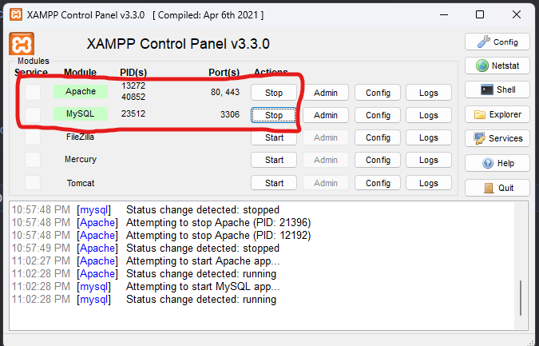
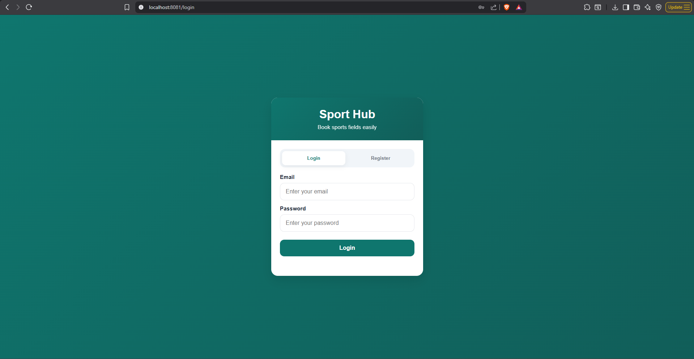
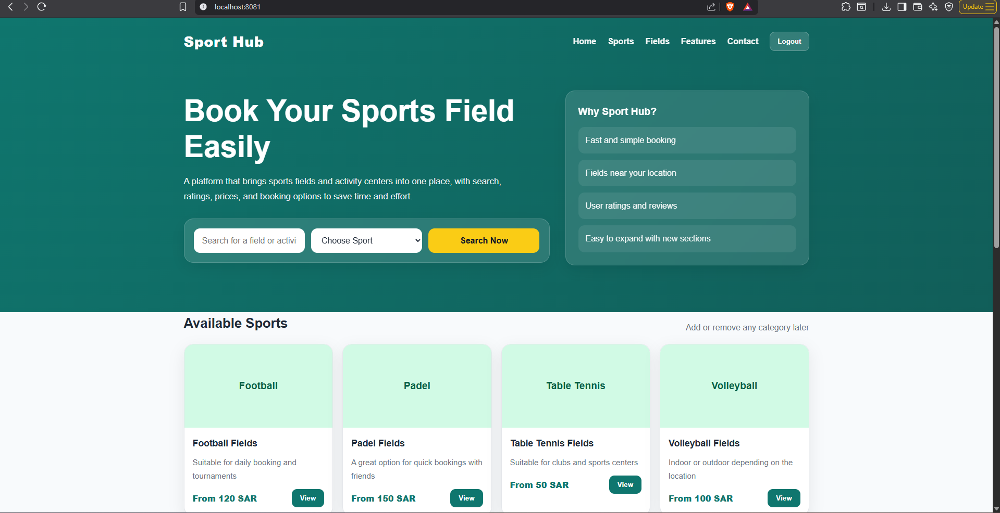
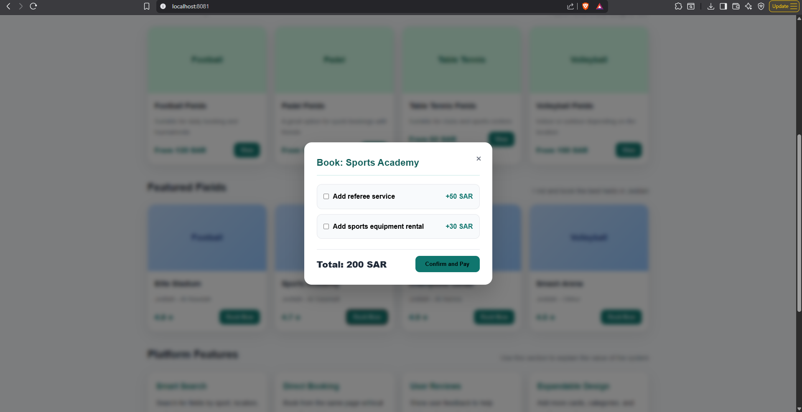
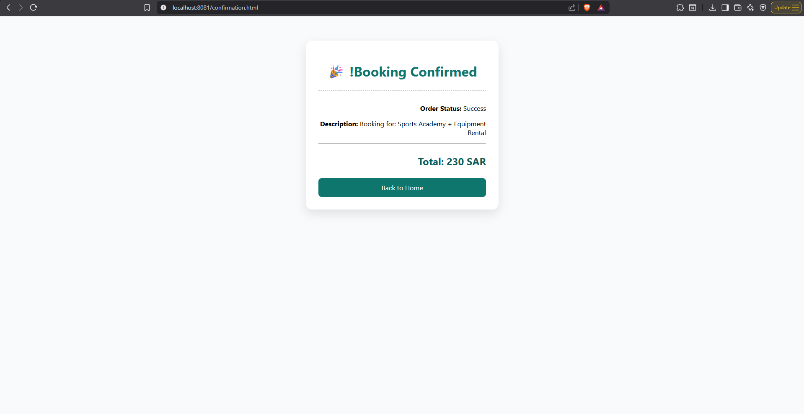

# Sport Hub

## Description
A centralized platform designed to streamline the booking process for various sports fields and activity centers (e.g., football, volleyball, padel, table tennis). It modernizes traditional, outdated reservation methods by providing a unified interface to discover, evaluate, and book sports facilities efficiently, addressing common issues like unresponsive management or inaccurate contact details.


## Features
- Centralized Booking: A single platform to book various sports facilities.

- Rating System: User ratings and reviews for each field to ensure quality and transparency.

- Customizable Add-ons: Options to include extra services like a professional referee or sports equipment rental during the booking process.


## Usage

## First Release
### Requirements
* **Java 17**
* **XAMPP**

### How to Run

1. **Download:** Get the `sporthub-0.0.1-SNAPSHOT.jar` file.
2. **Database:** Start **Apache** & **MySQL** in XAMPP.
3. **Run:** Open terminal in the file's folder and run: `java -jar sporthub-0.0.1-SNAPSHOT.jar`
4. **Access:** Visit `http://localhost:8081` in your browser.



## Second Release
**Highlights:** Decorator pattern, interactive web, and live DB.

### Requirements
* **Java 17**

### How to Run

1. **Run the App:**
   Open the terminal in the folder containing the JAR file, and execute:
   ```bash
   java -jar sporthub-1.0.1-SNAPSHOT.jar
   
## Screenshots





### This the data after booked


## License

MIT-License
## Note


* **Database:**
  Used to securely store registered user accounts and persist specific booking records for each customer.

* **Local Storage:**
  Utilized to maintain user sessions (keeping users logged in even after page refreshes) and to temporarily store the user's email during the field booking process.